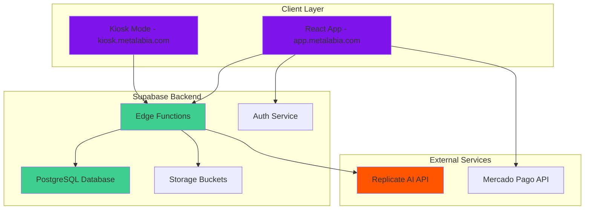
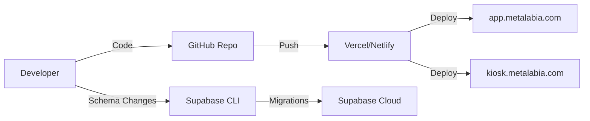

# Platform Architecture

Cabina is built as a modern serverless SaaS platform using React, TypeScript, and Supabase. The architecture supports both B2C and B2B2C business models with a shared codebase.

## High-Level Architecture



## Tech Stack

### Frontend

<CardGroup cols={2}>
  <Card title="Core Framework" icon="react">
    - **React 18** with TypeScript
    - **Vite** for build tooling
    - **React Router** for navigation (dashboard)
  </Card>
  <Card title="UI & Animations" icon="palette">
    - **TailwindCSS** for styling
    - **Framer Motion** for animations
    - **Lucide React** for icons
  </Card>
  <Card title="State Management" icon="database">
    - React Hooks (useState, useEffect)
    - Custom hooks for business logic
    - Supabase Realtime for sync
  </Card>
  <Card title="Special Libraries" icon="wand-magic-sparkles">
    - **canvas-confetti** for celebrations
    - **qrcode.react** for QR generation
    - **jszip** for bulk downloads
  </Card>
</CardGroup>

### Backend (Supabase)

<CardGroup cols={2}>
  <Card title="Database" icon="database">
    **PostgreSQL 15** with:
    - Row Level Security (RLS)
    - Atomic functions for credits
    - Realtime subscriptions
  </Card>
  <Card title="Edge Functions" icon="cloud">
    **Deno-based serverless functions**:
    - `cabina-vision` - AI generation orchestration
    - `mercadopago-payment` - Payment processing
  </Card>
  <Card title="Authentication" icon="shield">
    **Supabase Auth**:
    - Email/Password
    - OAuth (Google)
    - Anonymous sessions for events
  </Card>
  <Card title="Storage" icon="folder">
    **Supabase Storage**:
    - Partner logos
    - Event branding assets
    - Generated images (optional)
  </Card>
</CardGroup>

### External Integrations

- **Replicate API**: AI image generation using Flux models
- **Mercado Pago**: Payment processing for credit purchases
- **Cloudflare R2** (optional): CDN for generated images

---

## Database Schema

### Core Tables

```sql
-- User Profiles
CREATE TABLE profiles (
  id UUID PRIMARY KEY REFERENCES auth.users,
  email TEXT,
  credits INTEGER DEFAULT 500,
  total_generations INTEGER DEFAULT 0,
  is_master BOOLEAN DEFAULT false,
  role TEXT DEFAULT 'user', -- 'master', 'partner', 'client', 'user'
  unlocked_packs TEXT[],
  partner_id UUID REFERENCES partners(id)
);

-- Partners (Resellers)
CREATE TABLE partners (
  id UUID PRIMARY KEY DEFAULT uuid_generate_v4(),
  business_name TEXT NOT NULL,
  contact_email TEXT,
  contact_name TEXT,
  user_id UUID REFERENCES profiles(id),
  config JSONB, -- { logo_url, primary_color, enabled_styles }
  is_active BOOLEAN DEFAULT true,
  created_at TIMESTAMPTZ DEFAULT NOW()
);

-- Events
CREATE TABLE events (
  id UUID PRIMARY KEY DEFAULT uuid_generate_v4(),
  partner_id UUID REFERENCES partners(id),
  event_name TEXT NOT NULL,
  event_slug TEXT UNIQUE NOT NULL,
  config JSONB, -- { logo_url, primary_color, welcome_text, radius }
  selected_styles TEXT[], -- Array of style IDs
  credits_allocated INTEGER DEFAULT 0,
  credits_used INTEGER DEFAULT 0,
  start_date TIMESTAMPTZ,
  end_date TIMESTAMPTZ,
  is_active BOOLEAN DEFAULT true,
  created_at TIMESTAMPTZ DEFAULT NOW()
);

-- Generations (Photo Records)
CREATE TABLE generations (
  id UUID PRIMARY KEY DEFAULT uuid_generate_v4(),
  user_id UUID REFERENCES profiles(id), -- NULL for guest
  event_id UUID REFERENCES events(id), -- NULL for B2C
  style_id TEXT NOT NULL,
  image_url TEXT NOT NULL,
  aspect_ratio TEXT DEFAULT '9:16',
  created_at TIMESTAMPTZ DEFAULT NOW()
);
```

<Info>
See the full schema in `ARQUITECTURA-PLATAFORMA.md:92` in the source repository.
</Info>

### Atomic Credit Deduction

To prevent race conditions during high-traffic events:

```sql
CREATE OR REPLACE FUNCTION deduct_event_credit(event_uuid UUID)
RETURNS BOOLEAN AS $$
DECLARE
  remaining INTEGER;
BEGIN
  -- Atomic check and deduct
  UPDATE events
  SET credits_used = credits_used + 1
  WHERE id = event_uuid
    AND (credits_allocated - credits_used) > 0
  RETURNING (credits_allocated - credits_used - 1) INTO remaining;
  
  RETURN remaining IS NOT NULL;
END;
$$ LANGUAGE plpgsql;
```

<Tip>
This function is called from the Edge Function before starting AI generation, ensuring credits are never over-deducted even with 100+ concurrent guests.
</Tip>

---

## Application Flow

### B2C Generation Flow

```typescript
// src/App.tsx:703
const handleSubmit = async (e: React.FormEvent) => {
  e.preventDefault();
  
  // 1. Verify credits
  if (profile.credits < 100) {
    setErrorMessage("Saldo insuficiente.");
    return;
  }
  
  // 2. Deduct credits (optimistic)
  await supabase
    .from('profiles')
    .update({ credits: profile.credits - 100 })
    .eq('id', session.user.id);
  
  // 3. Call Edge Function
  const { data, error } = await supabase.functions.invoke('cabina-vision', {
    body: {
      user_photo: capturedImage,
      model_id: selectedStyle.id,
      aspect_ratio: formData.aspectRatio,
      user_id: session.user.id
    }
  });
  
  // 4. Handle result
  if (data?.success) {
    setResultImage(data.image_url);
  } else {
    // Refund on error
    await supabase
      .from('profiles')
      .update({ credits: profile.credits })
      .eq('id', session.user.id);
  }
};
```

### B2B2C Event Flow

```typescript
// src/components/kiosk/GuestExperience.tsx:116
const handleGenerate = async () => {
  // No auth check - guests don't need accounts
  
  const { data, error } = await supabase.functions.invoke('cabina-vision', {
    body: {
      user_photo: capturedImage,
      model_id: selectedStyle.id,
      aspect_ratio: '9:16',
      event_id: eventConfig.id,
      guest_id: `guest_${Date.now()}`
    }
  });
  
  // Credits deducted atomically in Edge Function
  if (data?.success) {
    setResultImage(data.image_url);
    // Confetti celebration
    confetti({ 
      particleCount: 150,
      colors: [eventConfig.config.primary_color, '#ffffff']
    });
  }
};
```

---

## Edge Function: cabina-vision

The core AI generation orchestrator:

```typescript
// supabase/functions/cabina-vision/index.ts
Deno.serve(async (req) => {
  const { user_photo, model_id, event_id, user_id } = await req.json();
  
  // 1. Deduct credits atomically (for events)
  if (event_id) {
    const { data: canProceed } = await supabaseAdmin.rpc(
      'deduct_event_credit',
      { event_uuid: event_id }
    );
    
    if (!canProceed) {
      return new Response(
        JSON.stringify({ success: false, error: 'No credits' }),
        { status: 402 }
      );
    }
  }
  
  // 2. Start Replicate prediction
  const prediction = await replicate.predictions.create({
    model: FLUX_MODEL,
    input: {
      prompt: getPromptForStyle(model_id),
      image: user_photo,
      strength: 0.85
    }
  });
  
  // 3. Poll for completion (max 60s)
  let result = prediction;
  for (let i = 0; i < 30; i++) {
    await sleep(2000);
    result = await replicate.predictions.get(prediction.id);
    if (result.status === 'succeeded') break;
  }
  
  // 4. Save to database
  await supabaseAdmin.from('generations').insert({
    user_id,
    event_id,
    style_id: model_id,
    image_url: result.output[0]
  });
  
  return new Response(
    JSON.stringify({ success: true, image_url: result.output[0] }),
    { headers: { 'Content-Type': 'application/json' } }
  );
});
```

<Warning>
**Timeout Handling**: If the Edge Function times out (>60s), the frontend enables "background processing mode" and allows users to continue browsing.
</Warning>

---

## Multi-Entry Points

Cabina uses route-based separation for different business models:

```typescript
// src/index.tsx:8
const subdomain = window.location.hostname.split('.')[0];

if (subdomain === 'kiosk' || window.location.pathname.includes('dashboard')) {
  // B2B Admin Interface
  ReactDOM.createRoot(document.getElementById('root')!).render(
    <DashboardApp />
  );
} else {
  // B2C Public App
  ReactDOM.createRoot(document.getElementById('root')!).render(
    <App />
  );
}
```

### URL Structure

- `https://app.metalabia.com` → B2C Public App
- `https://app.metalabia.com?event=maria-quince` → Guest Experience
- `https://kiosk.metalabia.com/dashboard.html` → Partner Dashboard
- `https://app.metalabia.com/dashboard.html` → Master Admin

---

## Row Level Security (RLS)

Supabase RLS ensures data isolation:

```sql
-- Events are publicly readable (for guests)
CREATE POLICY "public_read_events" ON events
  FOR SELECT USING (true);

-- Partners can only see their own events
CREATE POLICY "partners_own_events" ON events
  FOR SELECT USING (
    partner_id IN (
      SELECT id FROM partners WHERE user_id = auth.uid()
    )
  );

-- Masters see everything
CREATE POLICY "master_all_access" ON events
  FOR ALL USING (
    EXISTS (
      SELECT 1 FROM profiles 
      WHERE id = auth.uid() AND is_master = true
    )
  );
```

---

## Scalability Considerations

<CardGroup cols={2}>
  <Card title="Database" icon="database">
    - Indexed queries on `event_slug`, `user_id`
    - Partitioning for `generations` table (future)
    - Connection pooling via Supabase
  </Card>
  <Card title="Frontend" icon="browser">
    - Code splitting with React.lazy
    - Image lazy loading
    - Background processing for long tasks
  </Card>
  <Card title="Edge Functions" icon="cloud">
    - Stateless design for horizontal scaling
    - Built-in retry logic
    - Timeout handling with polling fallback
  </Card>
  <Card title="AI Processing" icon="brain">
    - Replicate auto-scales based on demand
    - Queuing built into Replicate API
    - Fallback to alternative models on failure
  </Card>
</CardGroup>

---

## Deployment Architecture



<Info>
**CI/CD**: Every push to `main` triggers automatic deployment. Database migrations are run manually via Supabase CLI.
</Info>

---

## Next Steps

<CardGroup cols={2}>
  <Card title="Business Models" icon="building" href="/concepts/business-models">
    Understand the dual B2C and B2B2C models
  </Card>
  <Card title="Multi-Tier System" icon="sitemap" href="/concepts/multi-tier-system">
    Explore the Master → Partner → Client → Guest hierarchy
  </Card>
  <Card title="Credit System" icon="coins" href="/concepts/credit-system">
    Learn how atomic credits prevent double-billing
  </Card>
  <Card title="Event System" icon="calendar" href="/concepts/events">
    Deep dive into zero-friction events
  </Card>
</CardGroup>