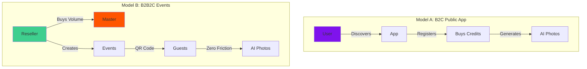

# Dual Business Models

Cabina operates on two independent yet complementary business models within a single platform. This architecture allows the platform to serve both **direct consumers** and **white-label resellers** without code duplication.

## Overview



---

## Model A: B2C Public App

### How It Works

Users discover the app organically (SEO, social media, referrals), create an account, and purchase credits to generate AI photos on-demand.

```typescript
// User journey in code
User → Descubre la app → Se registra → Compra Pack de Créditos (Mercado Pago) → Genera fotos
```

### Key Characteristics

<CardGroup cols={2}>
  <Card title="Target Audience" icon="user">
    Direct consumers who want AI photos for personal use
  </Card>
  <Card title="Monetization" icon="credit-card">
    Direct credit sales via Mercado Pago (500 credits = ~$10 USD)
  </Card>
  <Card title="Authentication" icon="lock">
    **Required** - Email/Google OAuth
  </Card>
  <Card title="Credit Deduction" icon="coins">
    From user's `profiles.credits` balance
  </Card>
</CardGroup>

### User Flow

<Steps>
  <Step title="Discovery">
    User finds the app via:
    - Organic search (SEO)
    - Social media posts
    - Referral links (referral system built-in)
  </Step>
  
  <Step title="Registration">
    Creates account using:
    ```typescript
    // Email/Password
    await supabase.auth.signUp({
      email: 'user@example.com',
      password: 'secure_password'
    });
    
    // OR Google OAuth
    await supabase.auth.signInWithOAuth({
      provider: 'google'
    });
    ```
    
    New users receive **500 free credits** (5 generations).
  </Step>
  
  <Step title="Purchase Credits">
    When credits run low, users buy packs:
    
    | Pack | Credits | Price (ARS) | Price (USD) |
    |------|---------|-------------|-------------|
    | Starter | 500 | $1,500 | ~$10 |
    | Popular | 1,500 | $3,900 | ~$25 |
    | Pro | 3,000 | $6,900 | ~$45 |
    
    ```typescript
    const { data } = await supabase.functions.invoke('mercadopago-payment', {
      body: {
        user_id: session.user.id,
        credits: 1500,
        price: 3900,
        pack_name: 'Popular'
      }
    });
    
    // Redirect to Mercado Pago checkout
    window.location.href = data.init_point;
    ```
  </Step>
  
  <Step title="Generate Photos">
    Each generation deducts **100 credits**:
    ```typescript
    // src/App.tsx:766
    const { error } = await supabase
      .from('profiles')
      .update({ credits: profile.credits - 100 })
      .eq('id', session.user.id);
    ```
  </Step>
  
  <Step title="Access History">
    Users can view all their generations in the History tab:
    ```typescript
    const { data } = await supabase
      .from('generations')
      .select('*')
      .eq('user_id', session.user.id)
      .order('created_at', { ascending: false });
    ```
  </Step>
</Steps>

### Revenue Streams

<Note>
**Direct Sales**: 100% of revenue from credit purchases goes to the platform (minus Mercado Pago fees ~5%)
</Note>

<Tip>
**Referral System**: Users who refer others earn 10% of their purchases as bonus credits (future feature)
</Tip>

---

## Model B: B2B2C Event / White-Label

### How It Works

Resellers (Partners) purchase credits in bulk, create branded events for their clients, and guests generate photos without registration using a zero-friction QR code system.

```typescript
// Event journey in code
Revendedor → Compra créditos al Master → Crea evento para su cliente → 
Cliente configura su evento → Invitados generan fotos (sin login)
```

### Key Characteristics

<CardGroup cols={2}>
  <Card title="Target Audience" icon="building">
    Event agencies, photographers, party planners
  </Card>
  <Card title="Monetization" icon="sack-dollar">
    Bulk credit sales to Partners (wholesale pricing)
  </Card>
  <Card title="Authentication" icon="unlock">
    **NOT required** for guests - Zero friction access
  </Card>
  <Card title="Credit Deduction" icon="database">
    From event pool (`events.credits_allocated`) atomically
  </Card>
</CardGroup>

### Partner (Reseller) Flow

<Steps>
  <Step title="Partner Onboarding">
    Master admin creates Partner account:
    ```typescript
    // src/components/dashboards/admin/PartnersSection.tsx
    const { data: partner } = await supabase
      .from('partners')
      .insert({
        business_name: 'Eventos Mágicos SRL',
        contact_email: 'eventos@magicos.com',
        contact_name: 'Juan Pérez'
      })
      .select()
      .single();
    
    // Create linked user account
    const { data: user } = await supabase.auth.admin.createUser({
      email: 'eventos@magicos.com',
      password: generateSecurePassword(),
      email_confirm: true
    });
    
    // Link partner to user
    await supabase
      .from('profiles')
      .update({ role: 'partner', partner_id: partner.id })
      .eq('id', user.id);
    ```
  </Step>
  
  <Step title="Purchase Credits">
    Partner buys credits at wholesale rates:
    - **10,000 credits** = $50 USD (vs $100 retail)
    - Credits stored in `partners` table
    - Can be distributed across multiple events
  </Step>
  
  <Step title="Create Event">
    Partner creates event for a client:
    ```typescript
    // src/hooks/usePartnerDashboard.ts:67
    const { data: event } = await supabase
      .from('events')
      .insert({
        partner_id: partner.id,
        event_name: "María's Quinceañera",
        event_slug: 'maria-quince-2026',
        credits_allocated: 5000, // 50 photos
        selected_styles: ['pixar_a', 'disney_a', 'barbie_a'],
        config: {
          logo_url: 'https://cdn.example.com/maria-logo.png',
          primary_color: '#ff69b4',
          welcome_text: '¡Bienvenidos a mis 15!'
        },
        start_date: '2026-03-15T18:00:00Z',
        end_date: '2026-03-16T03:00:00Z'
      })
      .select()
      .single();
    ```
  </Step>
  
  <Step title="Configure Branding">
    Partner customizes event appearance:
    - **Logo**: Upload via Supabase Storage
    - **Color**: Hex color picker → CSS variables
    - **Styles**: Select from 45+ available AI styles
    - **Welcome Message**: Custom greeting text
    
    <Info>
    Branding is applied dynamically at runtime via CSS variables. See [Multi-Tier System](/concepts/multi-tier-system) for details.
    </Info>
  </Step>
  
  <Step title="Distribute QR Code">
    Generate and print QR code for event:
    ```typescript
    const eventUrl = `https://app.metalabia.com?event=maria-quince-2026`;
    
    <QRCodeSVG 
      value={eventUrl}
      size={512}
      level="H" // High error correction
      includeMargin={true}
    />
    ```
    
    Partner can:
    - Download high-res PNG/SVG
    - Print on table tents
    - Display on screens at venue
  </Step>
</Steps>

### Client (Event Host) Experience

<Note>
**Limited Access**: Clients (e.g., "papá del quinceañero") can view their event dashboard with a PIN, but cannot create new events or modify branding.
</Note>

Clients can:
- View live gallery of generated photos
- Download QR code
- See credit usage stats
- **Cannot**: Create events, change branding, access other events

### Guest (Zero-Friction) Experience

<Steps>
  <Step title="Scan QR Code">
    Guest scans QR at event venue:
    ```typescript
    // src/App.tsx:283
    const params = new URLSearchParams(window.location.search);
    const eventSlug = params.get('event');
    
    const { data: event } = await supabase
      .from('events')
      .select('*')
      .eq('event_slug', eventSlug)
      .single();
    ```
  </Step>
  
  <Step title="Event Validation">
    Platform validates:
    - Event exists
    - Within date range (start_date ≤ now ≤ end_date)
    - Credits available (allocated - used > 0)
    
    ```typescript
    // src/App.tsx:304
    const now = new Date();
    if (data.start_date && new Date(data.start_date) > now) {
      setEventError(`Evento aún no comenzó`);
      return;
    }
    if (data.end_date && new Date(data.end_date) < now) {
      setEventError(`Evento finalizó`);
      return;
    }
    const remaining = data.credits_allocated - data.credits_used;
    if (remaining <= 0) {
      setEventError(`Créditos agotados`);
      return;
    }
    ```
  </Step>
  
  <Step title="Apply Branding">
    Event branding loaded and applied:
    ```typescript
    // src/App.tsx:346
    const primary = eventConfig.config.primary_color;
    const glow = hexToRgba(primary, 0.4);
    
    document.documentElement.style.setProperty('--accent-color', primary);
    document.documentElement.style.setProperty('--accent-glow', glow);
    ```
  </Step>
  
  <Step title="Zero-Friction Generation">
    Guest selects style → captures photo → generates:
    ```typescript
    // src/components/kiosk/GuestExperience.tsx:124
    const { data } = await supabase.functions.invoke('cabina-vision', {
      body: {
        user_photo: capturedImage,
        model_id: selectedStyle.id,
        aspect_ratio: '9:16',
        event_id: eventConfig.id,
        guest_id: `guest_${Date.now()}` // No user_id needed
      }
    });
    ```
    
    <Warning>
    **No Authentication**: Guests never create accounts. All tracking is via `guest_id` and `event_id`.
    </Warning>
  </Step>
  
  <Step title="Download & Share">
    Guest can:
    - Download high-res image
    - Share via WhatsApp (mobile)
    - Generate QR code for later access
    - **Cannot**: View other guests' photos
  </Step>
</Steps>

### Revenue Streams

<CardGroup cols={2}>
  <Card title="Wholesale Credit Sales" icon="coins">
    Partners buy credits at 50% discount, resell to clients at markup
  </Card>
  <Card title="Subscription Plans" icon="calendar">
    Monthly subscriptions for high-volume partners (future)
  </Card>
  <Card title="White-Label Licensing" icon="building">
    Annual fee for full white-label deployment (future)
  </Card>
  <Card title="Custom AI Styles" icon="wand-magic-sparkles">
    Premium charge for training custom brand styles (future)
  </Card>
</CardGroup>

---

## Comparison Table

| Feature | B2C Public App | B2B2C Events |
|---------|---------------|-------------|
| **Authentication** | Required | Not required (guests) |
| **Credit Source** | `profiles.credits` | `events.credits_allocated` |
| **Payment** | Mercado Pago (per user) | Bulk purchase (partner) |
| **Branding** | Fixed platform branding | Custom per event |
| **Dashboard** | User history view | 3-tier (Master/Partner/Client) |
| **URL Structure** | `app.metalabia.com` | `app.metalabia.com?event=slug` |
| **Target Market** | General consumers | Event agencies, photographers |
| **Pricing** | $10 per 500 credits | $5 per 500 credits (wholesale) |
| **Analytics** | Per-user stats | Per-event + partner stats |

---

## Code Organization

### Shared Components

Both models share:
- AI generation engine (`src/hooks/useGeneration.ts`)
- Style library (`src/lib/constants.ts`)
- Database client (`src/lib/supabaseClient.ts`)
- Camera interface (`src/components/UploadCard.tsx`)

### Model-Specific Code

**B2C Only**:
- `src/App.tsx` - Main app logic
- `src/components/PacksView.tsx` - Credit purchase UI
- `src/components/Auth.tsx` - Login/signup

**B2B2C Only**:
- `src/components/kiosk/GuestExperience.tsx` - Zero-friction UI
- `src/components/dashboards/PartnerDashboard.tsx` - Reseller panel
- `src/components/dashboards/ClientDashboard.tsx` - Event host panel
- `src/components/dashboards/Admin.tsx` - Master control

---

## Next Steps

<CardGroup cols={2}>
  <Card title="Multi-Tier System" icon="sitemap" href="/concepts/multi-tier-system">
    Understand the 4-level hierarchy: Master → Partner → Client → Guest
  </Card>
  <Card title="Credit System" icon="coins" href="/concepts/credit-system">
    Learn how atomic credits prevent race conditions
  </Card>
  <Card title="Event System" icon="calendar" href="/concepts/events">
    Deep dive into event lifecycle and zero-friction access
  </Card>
  <Card title="Architecture" icon="sitemap" href="/architecture">
    See how both models coexist in the codebase
  </Card>
</CardGroup>