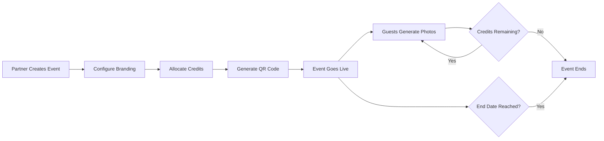

# Event System

Cabina's event system enables **zero-friction** AI photo booth experiences at weddings, quinceañeras, corporate events, and parties. Guests scan a QR code and generate photos instantly without registration or payment.

## What is an Event?

An event is a **time-bound, branded photo booth experience** created by a Partner for their client.

```typescript
interface Event {
  id: string;
  partner_id: string;            // Who created it
  event_name: string;            // "María's Quinceañera"
  event_slug: string;            // URL: ?event=maria-quince
  
  // Credits
  credits_allocated: number;     // Total budget (e.g., 5000 = 50 photos)
  credits_used: number;          // Consumed so far
  
  // Dates
  start_date: string;            // Event begins
  end_date: string;              // Event ends
  
  // Branding
  config: {
    logo_url?: string;           // Client logo
    primary_color: string;       // Hex color (#ff69b4)
    welcome_text: string;        // Greeting message
    show_welcome_screen: boolean;// Pre-event landing page
  };
  
  // AI Styles
  selected_styles: string[];     // ['pixar_a', 'disney_a', 'barbie_a']
  
  is_active: boolean;            // Can be disabled by partner
}
```

---

## Event Lifecycle



### Phase 1: Creation

<Steps>
  <Step title="Partner Initiates">
    Partner opens the "Crear Evento" modal:
    ```typescript
    // src/components/dashboards/partner/modals/CreateEventModal.tsx
    const [formData, setFormData] = useState({
      event_name: '',
      event_slug: '',
      credits_allocated: 5000,
      start_date: '',
      end_date: '',
      selected_styles: [],
      config: {
        logo_url: partner.config?.logo_url || '',
        primary_color: partner.config?.primary_color || '#7f13ec',
        welcome_text: 'Bienvenidos a nuestro evento'
      }
    });
    ```
  </Step>
  
  <Step title="Fill Event Details">
    Required fields:
    - **Event Name**: Display name (e.g., "Boda de Juan & María")
    - **Event Slug**: URL identifier (e.g., `boda-juan-maria`)
      - Auto-generated from name
      - Must be unique globally
      - Lowercase, alphanumeric + hyphens only
    
    ```typescript
    // Auto-generate slug from name
    const generateSlug = (name: string) => {
      return name
        .toLowerCase()
        .normalize('NFD')
        .replace(/[\u0300-\u036f]/g, '') // Remove accents
        .replace(/[^a-z0-9]+/g, '-')     // Replace spaces with hyphens
        .replace(/^-+|-+$/g, '');        // Trim hyphens
    };
    
    // "María's Quinceañera" → "marias-quinceanera"
    ```
  </Step>
  
  <Step title="Set Date Range">
    ```typescript
    start_date: '2026-03-15T18:00:00Z',  // 6 PM local time
    end_date: '2026-03-16T03:00:00Z'     // 3 AM next day
    ```
    
    <Info>
    If no dates are set, event is accessible immediately and indefinitely (not recommended).
    </Info>
  </Step>
  
  <Step title="Allocate Credits">
    Partner assigns credits from their wallet:
    ```typescript
    credits_allocated: 10_000  // 100 photos max
    ```
    
    <Warning>
    Credits are deducted from partner's available balance immediately. They CANNOT be returned to the wallet once allocated.
    </Warning>
  </Step>
  
  <Step title="Select AI Styles">
    Choose which styles guests can use:
    ```typescript
    selected_styles: [
      'pixar_a',      // Pixar animation
      'disney_a',     // Disney style
      'barbie_a',     // Barbie aesthetic
      'magazine_a'    // Magazine cover
    ]
    ```
    
    <Tip>
    Limit to 4-8 styles for focused events. Too many choices overwhelm guests.
    </Tip>
  </Step>
  
  <Step title="Customize Branding">
    Upload logo and choose colors:
    ```typescript
    // src/hooks/useBranding.ts:85
    const handleLogoUpload = async (file: File) => {
      // Upload to Supabase Storage
      const { data, error } = await supabase.storage
        .from('event-logos')
        .upload(`${partner.id}/${Date.now()}-${file.name}`, file);
      
      // Get public URL
      const { data: publicUrl } = supabase.storage
        .from('event-logos')
        .getPublicUrl(data.path);
      
      setBrandingConfig(prev => ({
        ...prev,
        logo_url: publicUrl.publicUrl
      }));
    };
    ```
  </Step>
  
  <Step title="Create Event">
    ```typescript
    // src/hooks/usePartnerDashboard.ts:67
    const { data: event, error } = await supabase
      .from('events')
      .insert({
        partner_id: partner.id,
        event_name: formData.event_name,
        event_slug: formData.event_slug,
        credits_allocated: formData.credits_allocated,
        credits_used: 0,
        start_date: formData.start_date,
        end_date: formData.end_date,
        selected_styles: formData.selected_styles,
        config: formData.config,
        is_active: true
      })
      .select()
      .single();
    ```
  </Step>
</Steps>

### Phase 2: Pre-Event (Optional)

If `config.show_welcome_screen = true` and `start_date` is in the future:

```typescript
// src/App.tsx:1096
if (isPreEvent) {
  return (
    <div className="pre-event-screen">
      {eventConfig.config?.logo_url && (
        
      )}
      <h1>{eventConfig.event_name}</h1>
      <p>{eventConfig.config?.welcome_text}</p>
      <p>Comienza el {new Date(eventConfig.start_date).toLocaleDateString()}</p>
    </div>
  );
}
```

Guests who scan the QR early see a countdown screen instead of the full experience.

### Phase 3: Live Event

<Steps>
  <Step title="Guest Scans QR">
    ```
    https://app.metalabia.com?event=maria-quince
    ```
  </Step>
  
  <Step title="Platform Validates Event">
    ```typescript
    // src/App.tsx:283
    const fetchEvent = async (eventSlug: string) => {
      const { data: event, error } = await supabase
        .from('events')
        .select('*')
        .eq('event_slug', eventSlug)
        .maybeSingle();
      
      if (!event) {
        setEventError('❌ Evento no encontrado');
        return;
      }
      
      // Validate dates
      const now = new Date();
      if (event.start_date && new Date(event.start_date) > now) {
        setEventError(`📅 Evento aún no comenzó`);
        return;
      }
      if (event.end_date && new Date(event.end_date) < now) {
        setEventError(`🎬 Evento finalizó`);
        return;
      }
      
      // Validate credits
      const remaining = event.credits_allocated - event.credits_used;
      if (remaining <= 0) {
        setEventError(`🎫 Créditos agotados`);
        return;
      }
      
      setEventConfig(event);
    };
    ```
  </Step>
  
  <Step title="Apply Branding">
    Event's custom branding is applied via CSS variables:
    ```typescript
    // src/App.tsx:346
    const primary = eventConfig.config.primary_color;
    const glow = hexToRgba(primary, 0.4);
    
    document.documentElement.style.setProperty('--accent-color', primary);
    document.documentElement.style.setProperty('--accent-glow', glow);
    ```
    
    All buttons, highlights, and accents now use the event's color.
  </Step>
  
  <Step title="Load Guest Experience">
    ```typescript
    // src/App.tsx:1137
    if (eventConfig && !isStaff) {
      return <GuestExperience eventConfig={eventConfig} supabase={supabase} />;
    }
    ```
  </Step>
  
  <Step title="Guest Generates Photos">
    See [Zero-Friction Flow](#zero-friction-flow) below.
  </Step>
</Steps>

### Phase 4: Post-Event

After `end_date` or when credits run out:

```typescript
// Event becomes read-only
// Guests see: "Este evento ya finalizó. ¡Gracias por participar!"
// Partner can still:
// - View analytics
// - Download all photos
// - Export generation report
```

---

## Zero-Friction Flow

The magic of Cabina's event system is **no friction for guests**.

<CardGroup cols={2}>
  <Card title="No Registration" icon="user-plus">
    Guests never create accounts or enter personal info
  </Card>
  <Card title="No Login" icon="lock">
    No username, password, or OAuth flow
  </Card>
  <Card title="No Payment" icon="credit-card">
    Credits come from event pool, not guest wallets
  </Card>
  <Card title="3-Step Flow" icon="mouse-pointer-click">
    Select style → Take photo → Download. That's it.
  </Card>
</CardGroup>

### Guest Journey

```typescript
// src/components/kiosk/GuestExperience.tsx:23
export const GuestExperience: React.FC<GuestExperienceProps> = ({
  eventConfig, supabase
}) => {
  const [step, setStep] = useState<Step>('WELCOME');
  
  // Step 1: Welcome screen with event branding
  // Step 2: Select AI style (from event.selected_styles)
  // Step 3: Capture photo with camera
  // Step 4: Processing (10-15 seconds)
  // Step 5: Result with download/share options
};
```

<Steps>
  <Step title="Welcome Screen">
    ```typescript
    <motion.div>
      {eventConfig.config?.logo_url && (
        
      )}
      <h1>{eventConfig.event_name}</h1>
      <h2>{eventConfig.config?.welcome_text || 'Bienvenidos'}</h2>
      <button onClick={() => setStep('STYLE_SELECTION')}>
        Iniciar Experiencia
      </button>
    </motion.div>
    ```
  </Step>
  
  <Step title="Style Selection">
    Only show styles selected by partner:
    ```typescript
    const availableStyles = IDENTITIES.filter(style => 
      eventConfig.selected_styles.includes(style.id)
    );
    
    // Display as grid of cards
    availableStyles.map(style => (
      <UploadCard
        key={style.id}
        title={style.title}
        sampleImageUrl={style.url}
        onSelect={() => {
          setSelectedStyle(style);
          setStep('CAMERA');
        }}
      />
    ));
    ```
  </Step>
  
  <Step title="Camera Capture">
    Simplified camera with auto-mirror:
    ```typescript
    const takePhoto = () => {
      const canvas = canvasRef.current;
      const video = videoRef.current;
      const ctx = canvas.getContext('2d');
      
      // Mirror the image for selfie naturalness
      ctx.translate(canvas.width, 0);
      ctx.scale(-1, 1);
      ctx.drawImage(video, 0, 0);
      
      setCapturedImage(canvas.toDataURL('image/jpeg', 0.8));
    };
    ```
  </Step>
  
  <Step title="AI Processing">
    Call Edge Function with event context:
    ```typescript
    const { data, error } = await supabase.functions.invoke('cabina-vision', {
      body: {
        user_photo: capturedImage,
        model_id: selectedStyle.id,
        aspect_ratio: '9:16',  // Fixed for mobile
        event_id: eventConfig.id,
        guest_id: `guest_${Date.now()}`
      }
    });
    ```
    
    <Note>
    No `user_id` is sent. Guests are anonymous. Tracking is via `guest_id` (timestamp-based).
    </Note>
  </Step>
  
  <Step title="Celebration & Download">
    ```typescript
    if (data?.success) {
      setResultImage(data.image_url);
      setStep('RESULT');
      
      // Confetti with event colors
      confetti({
        particleCount: 150,
        colors: [eventConfig.config.primary_color, '#ffffff']
      });
    }
    ```
    
    Guest can:
    - Download image
    - Share via WhatsApp (mobile)
    - Generate QR code for later access
    - Start over ("Hacer otra foto")
  </Step>
</Steps>

---

## QR Code Generation

Every event gets a unique QR code:

```typescript
// src/components/EventQRGenerator.tsx:14
const EventQRGenerator = ({ eventSlug }: { eventSlug: string }) => {
  const eventUrl = `https://app.metalabia.com?event=${eventSlug}`;
  
  return (
    <div>
      <QRCodeSVG
        value={eventUrl}
        size={512}
        level="H"          // High error correction (30%)
        includeMargin={true}
        imageSettings={{
          src: '/logo.png',
          height: 64,
          width: 64,
          excavate: true   // Remove background behind logo
        }}
      />
      
      <button onClick={downloadQR}>Descargar PNG</button>
      <button onClick={downloadSVG}>Descargar SVG</button>
    </div>
  );
};
```

<Tip>
**Print Recommendations**:
- **Table Tents**: 4x6" cards with QR code + instructions
- **Posters**: 11x17" at entrance with large QR
- **Screens**: Display QR on loop at photo booth station
</Tip>

---

## White-Label Branding

Events can be fully customized to match the client's brand.

### Logo Upload

```typescript
// src/hooks/useBranding.ts:100
const handleLogoUpload = async (file: File) => {
  // Validate file
  if (file.size > 5 * 1024 * 1024) {
    throw new Error('Logo debe ser menor a 5MB');
  }
  
  if (!file.type.startsWith('image/')) {
    throw new Error('Solo se aceptan imágenes');
  }
  
  setIsUploading(true);
  
  // Upload to Supabase Storage
  const filePath = `${partner.id}/${Date.now()}-${file.name}`;
  const { data, error } = await supabase.storage
    .from('event-logos')
    .upload(filePath, file, {
      cacheControl: '3600',
      upsert: false
    });
  
  if (error) throw error;
  
  // Get public URL
  const { data: publicUrl } = supabase.storage
    .from('event-logos')
    .getPublicUrl(data.path);
  
  // Update config
  setBrandingConfig(prev => ({
    ...prev,
    logo_url: publicUrl.publicUrl
  }));
  
  setIsUploading(false);
};
```

### Dynamic Color Application

```typescript
// Applied at runtime when event loads
const applyBranding = (primaryColor: string) => {
  const root = document.documentElement;
  
  // Main accent color
  root.style.setProperty('--accent-color', primaryColor);
  
  // Glow/shadow variant (40% opacity)
  const rgba = hexToRgba(primaryColor, 0.4);
  root.style.setProperty('--accent-glow', rgba);
  
  // All CSS using these variables updates instantly:
  // - Buttons background
  // - Text highlights
  // - Loading spinners
  // - Confetti colors
};

// Example usage:
applyBranding('#ff69b4');  // Hot pink for a quinceañera
```

<Info>
**CSS Variables Used**:
- `--accent-color`: Primary brand color
- `--accent-glow`: Semi-transparent glow effect
</Info>

### Welcome Message

Custom greeting text:

```typescript
config: {
  welcome_text: '¡Bienvenidos a la boda de Juan & María! 💍'
}
```

Displayed prominently on the welcome screen.

---

## Event Analytics

### Partner View

```typescript
// src/components/dashboards/partner/EventsSection.tsx:25
const eventStats = {
  total_photos: 87,
  credits_used: 8_700,
  credits_remaining: 1_300,
  avg_generation_time: '12s',
  peak_usage: '22:30 - 23:00',
  most_popular_style: 'Pixar'
};
```

### Client View

```typescript
// src/components/dashboards/ClientDashboard.tsx:200
const clientView = {
  photos_generated: 87,
  credits_remaining: 1_300,
  event_url: 'app.metalabia.com?event=maria-quince',
  qr_downloads: 3,
  gallery_link: '/gallery?event=maria-quince'
};
```

### Live Gallery

Real-time photo feed:

```typescript
// src/components/EventGallery.tsx:14
const LiveGallery = ({ eventId }: { eventId: string }) => {
  const [photos, setPhotos] = useState<any[]>([]);
  
  useEffect(() => {
    // Subscribe to new generations
    const subscription = supabase
      .channel(`event_${eventId}`)
      .on(
        'postgres_changes',
        {
          event: 'INSERT',
          schema: 'public',
          table: 'generations',
          filter: `event_id=eq.${eventId}`
        },
        (payload) => {
          setPhotos(prev => [payload.new, ...prev]);
          playShutterSound();
        }
      )
      .subscribe();
    
    return () => subscription.unsubscribe();
  }, [eventId]);
  
  return (
    <div className="photo-grid">
      {photos.map(photo => (
        
      ))}
    </div>
  );
};
```

<Tip>
**Display on Screen**: Partners often connect a tablet/monitor to the live gallery URL and display it at the event for guests to see all photos in real-time.
</Tip>

---

## Code References

| Feature | File | Line |
|---------|------|------|
| Event Creation Modal | `src/components/dashboards/partner/modals/CreateEventModal.tsx` | 1 |
| Event Validation | `src/App.tsx` | 283 |
| Guest Experience | `src/components/kiosk/GuestExperience.tsx` | 23 |
| Branding Application | `src/App.tsx` | 346 |
| QR Generator | `src/components/EventQRGenerator.tsx` | 14 |
| Live Gallery | `src/components/EventGallery.tsx` | 14 |
| Credit Deduction | `supabase/functions/cabina-vision/index.ts` | ~50 |

---

## Best Practices

<CardGroup cols={2}>
  <Card title="Generous Credit Allocation" icon="coins">
    Allocate 20% more than expected. Running out mid-event creates bad experience.
  </Card>
  <Card title="Test QR Before Printing" icon="qrcode">
    Scan the QR yourself to verify it works before printing 100 copies.
  </Card>
  <Card title="Limit Style Selection" icon="palette">
    4-8 styles max. Too many choices overwhelm guests and slow decision-making.
  </Card>
  <Card title="Monitor Live" icon="chart-line">
    Keep client dashboard open during event to catch issues early.
  </Card>
</CardGroup>

---

## Next Steps

<CardGroup cols={2}>
  <Card title="Credit System" icon="coins" href="/concepts/credit-system">
    Learn how atomic credits prevent race conditions
  </Card>
  <Card title="Multi-Tier System" icon="sitemap" href="/concepts/multi-tier-system">
    Understand Partner → Client → Guest hierarchy
  </Card>
  <Card title="Business Models" icon="building" href="/concepts/business-models">
    See how events fit into the B2B2C model
  </Card>
  <Card title="Quickstart" icon="rocket" href="/quickstart">
    Create your first event in 5 minutes
  </Card>
</CardGroup>