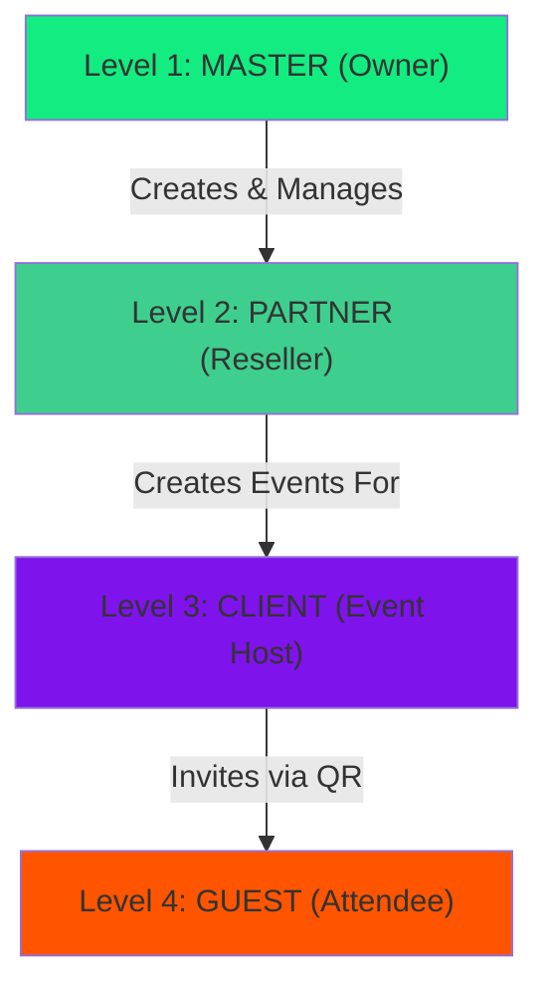

# Multi-Tier Access System

Cabina implements a 4-level hierarchy that provides granular access control while maintaining simplicity for end users. This system powers the B2B2C event model.

## The 4 Levels



---

## Level 1: MASTER (Eagle-Eye)

The platform owner (Leo) with complete control over all aspects.

### Capabilities

<CardGroup cols={2}>
  <Card title="Partner Management" icon="building">
    - Create/edit/deactivate partners
    - Assign credits to partners
    - View all partner transactions
    - Approve/reject partner applications
  </Card>
  <Card title="Event Oversight" icon="calendar">
    - View ALL events across all partners
    - Monitor credit usage globally
    - Access event analytics
    - Override event settings
  </Card>
  <Card title="Platform Control" icon="sliders">
    - Manage AI style library
    - Configure global settings
    - Access system logs
    - Modify pricing tiers
  </Card>
  <Card title="B2C Management" icon="users">
    - Manage direct users
    - Process refunds
    - View purchase history
    - Handle support tickets
  </Card>
</CardGroup>

### Dashboard Access

```typescript
// src/components/dashboards/Admin.tsx:27
export const Admin: React.FC<AdminProps> = ({ onBack }) => {
  const [view, setView] = useState<
    'overview' | 'partners' | 'b2c' | 'styles' | 'logs' | 'settings'
  >('overview');
  
  // Master sees everything
  const {
    partners,        // All partners
    b2cUsers,        // All B2C users
    stats,           // Global stats
    recentLogs,      // System logs
    stylesMetadata   // AI style library
  } = useAdmin({ showToast });
  
  // ...
};
```

### Database Access

```sql
-- Master has unrestricted access via RLS policy
CREATE POLICY "master_all_access" ON events
  FOR ALL USING (
    EXISTS (
      SELECT 1 FROM profiles 
      WHERE id = auth.uid() AND is_master = true
    )
  );
```

### Key Features

<Steps>
  <Step title="Global Analytics">
    View platform-wide metrics:
    ```typescript
    const stats = {
      total_partners: 15,
      total_events: 247,
      total_generations: 12_543,
      total_revenue: '$45,320 USD',
      active_events: 8
    };
    ```
  </Step>
  
  <Step title="Partner Creation">
    Onboard new resellers:
    ```typescript
    // src/hooks/useAdmin.ts:60
    const handleCreatePartner = async (partnerData: PartnerFormData) => {
      // 1. Create partner record
      const { data: partner } = await supabaseAdmin
        .from('partners')
        .insert({
          business_name: partnerData.business_name,
          contact_email: partnerData.contact_email,
          contact_name: partnerData.contact_name
        })
        .select()
        .single();
      
      // 2. Create user account
      const { data: user } = await supabaseAdmin.auth.admin.createUser({
        email: partnerData.contact_email,
        password: generateSecurePassword(),
        email_confirm: true
      });
      
      // 3. Link partner to user
      await supabaseAdmin
        .from('profiles')
        .update({ role: 'partner', partner_id: partner.id })
        .eq('id', user.id);
      
      // 4. Send welcome email
      await sendPartnerWelcomeEmail(partnerData.contact_email);
    };
    ```
  </Step>
  
  <Step title="AI Style Management">
    Control the style library:
    ```typescript
    // Toggle style visibility globally
    await supabase
      .from('styles_metadata')
      .update({ is_active: false })
      .eq('id', 'pixar_a');
    
    // Set premium flag
    await supabase
      .from('styles_metadata')
      .update({ is_premium: true })
      .eq('id', 'renaissance_a');
    ```
  </Step>
  
  <Step title="System Monitoring">
    Real-time log viewing:
    ```typescript
    // src/components/dashboards/admin/AdminLogsSection.tsx
    const { data: logs } = await supabase
      .from('system_logs')
      .select('*')
      .order('created_at', { ascending: false })
      .limit(50);
    
    // Logs include:
    // - Generation errors
    // - Payment failures
    // - Partner actions
    // - API rate limits
    ```
  </Step>
</Steps>

---

## Level 2: PARTNER (Reseller)

Agencies or photographers who create branded events for clients.

### Capabilities

<CardGroup cols={2}>
  <Card title="Event Creation" icon="plus">
    Create unlimited events for clients with custom branding
  </Card>
  <Card title="Credit Management" icon="wallet">
    Purchase credits in bulk, allocate to events
  </Card>
  <Card title="Branding Control" icon="palette">
    Customize logo, colors, and welcome text per event
  </Card>
  <Card title="Analytics" icon="chart-line">
    View stats for ONLY their events (not other partners)
  </Card>
</CardGroup>

### Dashboard Access

```typescript
// src/components/dashboards/PartnerDashboard.tsx:42
export const PartnerDashboard: React.FC<PartnerDashboardProps> = ({
  user, profile, onBack
}) => {
  const {
    partner,              // Their partner record
    events,               // ONLY their events
    transactions,         // Their credit purchases
    clients,              // Their client list
    generationsData       // Stats for their events
  } = usePartnerDashboard({ profile, showToast });
  
  // Partner CANNOT see:
  // - Other partners' events
  // - Global platform stats
  // - Other partners' clients
};
```

### Database Access

```sql
-- Partners can only see their own events
CREATE POLICY "partners_own_events" ON events
  FOR SELECT USING (
    partner_id IN (
      SELECT id FROM partners WHERE user_id = auth.uid()
    )
  );

-- Partners can create events under their account
CREATE POLICY "partners_create_events" ON events
  FOR INSERT WITH CHECK (
    partner_id IN (
      SELECT id FROM partners WHERE user_id = auth.uid()
    )
  );
```

### White-Label Branding

Partners customize the event experience:

```typescript
// src/hooks/useBranding.ts:85
const handleUpdateBranding = async () => {
  const { error } = await supabase
    .from('partners')
    .update({
      config: {
        logo_url: brandingConfig.logo_url,
        primary_color: brandingConfig.primary_color,
        enabled_styles: brandingConfig.enabled_styles,
        business_tagline: brandingConfig.business_tagline
      }
    })
    .eq('id', partner.id);
  
  // Branding is inherited by all events created by this partner
};
```

<Info>
**Branding Inheritance**: Event-level branding overrides partner-level branding. If an event has no custom logo, it inherits the partner's logo.
</Info>

### Event Creation Flow

<Steps>
  <Step title="Open Create Modal">
    Partner clicks "Crear Evento" button:
    ```typescript
    // src/components/dashboards/partner/modals/CreateEventModal.tsx
    const [formData, setFormData] = useState({
      event_name: '',
      event_slug: '',
      credits_allocated: 5000,
      selected_styles: [],
      start_date: '',
      end_date: '',
      config: {
        logo_url: partner.config?.logo_url || '',
        primary_color: partner.config?.primary_color || '#7f13ec',
        welcome_text: 'Bienvenidos a nuestro evento'
      }
    });
    ```
  </Step>
  
  <Step title="Fill Event Details">
    Partner configures:
    - Event name: "Boda de Juan & María"
    - Slug: `boda-juan-maria-2026`
    - Credits: 10,000 (100 photos)
    - Dates: March 15-16, 2026
  </Step>
  
  <Step title="Customize Branding">
    Optional event-specific branding:
    - Upload couple's logo
    - Choose wedding color (#ff69b4)
    - Set welcome message
  </Step>
  
  <Step title="Select AI Styles">
    Choose styles available to guests:
    ```typescript
    selected_styles: [
      'pixar_a',      // Pixar style
      'barbie_a',     // Barbie style
      'magazine_a'    // Magazine cover
    ]
    ```
    
    <Warning>
    If no styles are selected, ALL active styles become available (not recommended for focused events).
    </Warning>
  </Step>
  
  <Step title="Create Event">
    ```typescript
    // src/hooks/usePartnerDashboard.ts:67
    const { data: event, error } = await supabase
      .from('events')
      .insert({
        partner_id: partner.id,
        event_name: formData.event_name,
        event_slug: formData.event_slug,
        credits_allocated: formData.credits_allocated,
        selected_styles: formData.selected_styles,
        config: formData.config,
        start_date: formData.start_date,
        end_date: formData.end_date
      })
      .select()
      .single();
    
    if (error) throw error;
    showToast('Evento creado exitosamente');
    ```
  </Step>
</Steps>

### Credit Wallet

Partners manage credits like a bank account:

```typescript
// src/components/dashboards/partner/WalletSection.tsx:24
const partnerWallet = {
  total_purchased: 50_000,  // Bought from Master
  allocated: 35_000,        // Assigned to events
  available: 15_000,        // Unallocated balance
  used: 28_450             // Actually consumed
};
```

<Tip>
**Top-Up Events**: Partners can add more credits to a running event if it's running low, preventing guest disappointment.
</Tip>

---

## Level 3: CLIENT (Event Host)

The end client (e.g., bride, quinceañera's parent) who views their event dashboard.

### Capabilities

<CardGroup cols={2}>
  <Card title="View Event Stats" icon="chart-bar">
    See credit usage, photos generated, and live gallery
  </Card>
  <Card title="Download QR Code" icon="qrcode">
    Get high-res QR for printing and display
  </Card>
  <Card title="Monitor Live Gallery" icon="images">
    Watch photos appear in real-time as guests generate them
  </Card>
  <Card title="Limited Configuration" icon="lock">
    Can tweak welcome message but NOT branding or credits
  </Card>
</CardGroup>

### Dashboard Access

```typescript
// src/components/dashboards/ClientDashboard.tsx:1
export const ClientDashboard: React.FC<ClientDashboardProps> = ({
  event, onBack
}) => {
  // Client sees ONLY this event
  // Cannot create new events
  // Cannot access other events
  // Cannot modify credits or styles
  
  const creditsRemaining = event.credits_allocated - event.credits_used;
  const photoCount = event.credits_used / 100; // 100 credits per photo
  
  return (
    <div>
      <h1>{event.event_name}</h1>
      <p>{creditsRemaining} créditos restantes</p>
      <p>{photoCount} fotos generadas</p>
      <QRCodeDownload slug={event.event_slug} />
      <LiveGallery eventId={event.id} />
    </div>
  );
};
```

### Access Control

```sql
-- Clients can only view/update their specific event
CREATE POLICY "client_own_event" ON events
  FOR SELECT USING (
    client_email = (SELECT email FROM profiles WHERE id = auth.uid())
  );

-- Clients CANNOT modify credits or branding
CREATE POLICY "client_limited_update" ON events
  FOR UPDATE USING (
    client_email = (SELECT email FROM profiles WHERE id = auth.uid())
  )
  WITH CHECK (
    -- Can only update welcome_text
    config->>'welcome_text' IS DISTINCT FROM OLD.config->>'welcome_text'
    AND credits_allocated = OLD.credits_allocated
    AND selected_styles = OLD.selected_styles
  );
```

<Note>
**PIN Access**: Clients access their dashboard via a simple PIN code (e.g., `1234`) rather than full authentication. This keeps it simple for non-technical users.
</Note>

### Live Gallery

Real-time feed of guest photos:

```typescript
// src/components/EventGallery.tsx:14
const LiveGallery = ({ eventId }: { eventId: string }) => {
  const [photos, setPhotos] = useState<any[]>([]);
  
  useEffect(() => {
    // Initial fetch
    fetchPhotos();
    
    // Subscribe to new generations
    const subscription = supabase
      .channel(`event_${eventId}`)
      .on(
        'postgres_changes',
        {
          event: 'INSERT',
          schema: 'public',
          table: 'generations',
          filter: `event_id=eq.${eventId}`
        },
        (payload) => {
          setPhotos(prev => [payload.new, ...prev]);
          // Play celebration sound
          new Audio('/sounds/camera-shutter.mp3').play();
        }
      )
      .subscribe();
    
    return () => subscription.unsubscribe();
  }, [eventId]);
  
  // ...
};
```

---

## Level 4: GUEST (Attendee)

Event attendees with zero-friction access.

### Capabilities

<CardGroup cols={2}>
  <Card title="Zero-Friction Access" icon="unlock">
    No registration, no login, no payment required
  </Card>
  <Card title="AI Photo Generation" icon="wand-magic-sparkles">
    Select style → Capture photo → Generate → Download
  </Card>
  <Card title="Instant Sharing" icon="share">
    WhatsApp share, QR code for later download
  </Card>
  <Card title="Branded Experience" icon="palette">
    See event's custom logo, colors, and welcome message
  </Card>
</CardGroup>

### User Experience

```typescript
// src/components/kiosk/GuestExperience.tsx:23
export const GuestExperience: React.FC<GuestExperienceProps> = ({
  eventConfig, supabase
}) => {
  // No user account needed
  // No credit balance to check
  // No authentication flow
  
  const handleGenerate = async () => {
    const { data } = await supabase.functions.invoke('cabina-vision', {
      body: {
        user_photo: capturedImage,
        model_id: selectedStyle.id,
        event_id: eventConfig.id,
        guest_id: `guest_${Date.now()}`, // Anonymous identifier
        user_id: null // Explicitly null
      }
    });
    
    // Credit deduction happens server-side atomically
  };
};
```

### Access Flow

<Steps>
  <Step title="Scan QR Code">
    Guest scans printed QR at event:
    ```
    https://app.metalabia.com?event=maria-quince-2026
    ```
  </Step>
  
  <Step title="Auto-Load Event">
    Platform detects `?event=` parameter:
    ```typescript
    // src/App.tsx:283
    useEffect(() => {
      const params = new URLSearchParams(window.location.search);
      const eventSlug = params.get('event');
      
      if (eventSlug) {
        fetchEvent(eventSlug);
      }
    }, []);
    ```
  </Step>
  
  <Step title="Apply Branding">
    Event's custom branding loaded:
    ```typescript
    // src/App.tsx:346
    document.documentElement.style.setProperty(
      '--accent-color',
      eventConfig.config.primary_color
    );
    ```
  </Step>
  
  <Step title="Generate Photo">
    Guest uses simplified 3-step flow:
    1. Choose style (from event's `selected_styles`)
    2. Take selfie
    3. Generate and download
    
    <Info>
    No aspect ratio selection or advanced options - keeps it simple for non-technical users.
    </Info>
  </Step>
</Steps>

### Privacy & Limitations

<Warning>
**No Account = No History**: Guests cannot view past generations. Once they leave, photos are gone unless downloaded.
</Warning>

<Tip>
**QR Code for Photo**: Each generated photo gets a unique QR code that can be scanned to download later (if enabled by partner).
</Tip>

---

## Permission Matrix

| Action | Master | Partner | Client | Guest |
|--------|--------|---------|--------|-------|
| View all partners | ✅ | ❌ | ❌ | ❌ |
| Create partners | ✅ | ❌ | ❌ | ❌ |
| View all events | ✅ | ❌ | ❌ | ❌ |
| Create events | ✅ | ✅ | ❌ | ❌ |
| Edit event branding | ✅ | ✅ | ❌ | ❌ |
| View event analytics | ✅ | ✅ (own) | ✅ (own) | ❌ |
| Manage AI styles | ✅ | ❌ | ❌ | ❌ |
| Generate photos (B2C) | ✅ | ✅ | ✅ | ❌ |
| Generate photos (event) | ✅ | ✅ | ✅ | ✅ |
| Download QR code | ✅ | ✅ | ✅ | ❌ |
| View system logs | ✅ | ❌ | ❌ | ❌ |
| Manage B2C users | ✅ | ❌ | ❌ | ❌ |

---

## Code References

| Component | File | Purpose |
|-----------|------|----------|
| Master Dashboard | `src/components/dashboards/Admin.tsx:27` | Full platform control |
| Partner Dashboard | `src/components/dashboards/PartnerDashboard.tsx:42` | Reseller interface |
| Client Dashboard | `src/components/dashboards/ClientDashboard.tsx:1` | Event host view |
| Guest Experience | `src/components/kiosk/GuestExperience.tsx:23` | Zero-friction generation |
| RLS Policies | Database schema | Access control logic |

---

## Next Steps

<CardGroup cols={2}>
  <Card title="Credit System" icon="coins" href="/concepts/credit-system">
    Learn how atomic credits work across tiers
  </Card>
  <Card title="Event System" icon="calendar" href="/concepts/events">
    Deep dive into event lifecycle and validation
  </Card>
  <Card title="Business Models" icon="building" href="/concepts/business-models">
    Understand how B2C and B2B2C models interact
  </Card>
  <Card title="Architecture" icon="sitemap" href="/architecture">
    See the technical implementation
  </Card>
</CardGroup>