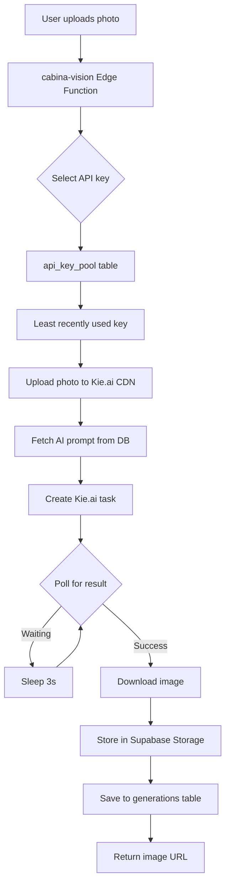

## Overview

Cabina uses **Kie.ai** (formerly Banana.dev) with the **Nano Banana Pro** model for AI-powered photo transformations. The integration is built around:

- **Model:** Nano Banana Pro (2K resolution, fast inference)
- **API:** Kie.ai REST API
- **Load Balancing:** API key pool for distributed requests
- **Storage:** Two-tier upload (Kie.ai CDN + Supabase fallback)

## Architecture



## Kie.ai Setup

### 1. Create Account

<Steps>
  <Step title="Sign up">
    Go to [kie.ai](https://kie.ai) and create an account
  </Step>
  
  <Step title="Get API key">
    - Navigate to Dashboard → API Keys
    - Click "Create new key"
    - Copy the key (format: `abc123def456...`)
  </Step>
  
  <Step title="Add credits">
    - Go to Billing
    - Purchase credits (used per generation)
    - Monitor usage in dashboard
  </Step>
</Steps>

### 2. Configure in Supabase

```bash
# Set primary API key
supabase secrets set BANANA_API_KEY=your-kie-ai-key-here
```

### 3. Add to API Key Pool (Optional)

For load balancing across multiple accounts:

```sql
INSERT INTO api_key_pool (api_key, account_name, is_active)
VALUES 
  ('key1_abc123', 'Account 1', true),
  ('key2_def456', 'Account 2', true),
  ('key3_ghi789', 'Account 3', true);
```

## Model Configuration

### Nano Banana Pro Specs

| Parameter | Value | Notes |
|-----------|-------|-------|
| **Model ID** | `nano-banana-pro` | Fast, high-quality |
| **Max Resolution** | 2K | 2048px on longest side |
| **Aspect Ratios** | All standard | 1:1, 3:4, 4:3, 9:16, 16:9 |
| **Output Format** | PNG, JPEG, WebP | PNG recommended |
| **Inference Time** | 10-30s | Depends on queue |
| **Cost** | ~$0.01/image | Check current pricing |

### Generation Parameters

Default configuration used in Cabina:

```typescript
const generationConfig = {
  model: 'nano-banana-pro',
  input: {
    prompt: masterPrompt,           // From identity_prompts table
    image_input: [photoUrl],        // User's photo URL
    aspect_ratio: '9:16',           // Portrait default
    resolution: '2K',               // Maximum quality
    output_format: 'png',           // Lossless
    guidance_scale: 7.5,            // Prompt adherence (optional)
    num_inference_steps: 50         // Quality vs speed (optional)
  }
};
```

## AI Prompts

### Prompt Structure

Prompts are stored in the `identity_prompts` table:

```sql
CREATE TABLE identity_prompts (
  id TEXT PRIMARY KEY,              -- Matches style ID
  master_prompt TEXT,               -- Full AI prompt
  created_at TIMESTAMPTZ DEFAULT NOW()
);
```

### Example Prompts

**Peaky Blinders Style:**
```
Professional cinematic portrait in the style of Peaky Blinders, 
1920s Birmingham England, wearing flat cap and vintage three-piece suit, 
moody atmospheric lighting, cigarette smoke, industrial background, 
sharp focus, film grain, muted color grading, dramatic shadows
```

**John Wick Style:**
```
Cinematic action movie portrait in John Wick style, 
wearing black tactical suit, neon city lights background, 
rainy night atmosphere, dramatic lighting, 
high contrast, professional photography, 4K quality
```

**Superhero Style:**
```
Epic superhero portrait in Marvel Avengers style, 
wearing high-tech armor suit, dramatic pose, 
energy effects, cityscape background, 
cinematic lighting, photorealistic, 8K detail
```

### Prompt Best Practices

<CardGroup cols={2}>
  <Card title="Be specific" icon="magnifying-glass">
    Detailed descriptions produce better results
  </Card>
  
  <Card title="Use style references" icon="palette">
    Reference known movies, shows, or art styles
  </Card>
  
  <Card title="Describe lighting" icon="lightbulb">
    Lighting is critical for photo realism
  </Card>
  
  <Card title="Add quality tags" icon="star">
    Include "4K", "professional", "sharp focus"
  </Card>
</CardGroup>

### Managing Prompts

```typescript
// Fetch prompt for a style
const { data } = await supabase
  .from('identity_prompts')
  .select('master_prompt')
  .eq('id', 'pb_a')
  .single();

const prompt = data.master_prompt;
```

**From source:** `supabase/functions/cabina-vision/index.ts:143-148`

## API Key Load Balancing

### How It Works

1. Function queries `api_key_pool` for active keys
2. Selects **least recently used** key
3. Uses that key for the request
4. Updates `last_used_at` and `usage_count`

```typescript
const { data: poolData } = await supabase
  .from('api_key_pool')
  .select('id, api_key')
  .eq('is_active', true)
  .order('last_used_at', { ascending: true })
  .limit(1)
  .maybeSingle();

const currentApiKey = poolData?.api_key || fallbackKey;
const keyId = poolData?.id;

// ... make API call ...

// Update usage
if (keyId) {
  await supabase
    .from('api_key_pool')
    .update({ 
      last_used_at: new Date().toISOString(), 
      usage_count: 1 
    })
    .eq('id', keyId);
}
```

**From source:** `supabase/functions/cabina-vision/index.ts:27-46`

### Benefits

- **Rate limit avoidance** - Distributes load across accounts
- **Fault tolerance** - If one key fails, others continue working
- **Cost distribution** - Spreads usage across multiple billing accounts

### Managing the Pool

```sql
-- Add new key
INSERT INTO api_key_pool (api_key, account_name)
VALUES ('new_key_here', 'Backup Account');

-- Disable problematic key
UPDATE api_key_pool 
SET is_active = false 
WHERE api_key = 'problem_key';

-- View usage stats
SELECT 
  account_name,
  usage_count,
  last_used_at,
  is_active
FROM api_key_pool
ORDER BY usage_count DESC;
```

## Photo Upload Pipeline

### Two-Tier Upload Strategy

1. **Primary:** Kie.ai CDN upload (fast, globally distributed)
2. **Fallback:** Supabase Storage (reliable, integrated)

```typescript
let publicPhotoUrl = user_photo;

// Try Kie.ai upload first
try {
  const upRes = await fetch(
    'https://kieai.redpandaai.co/api/file-base64-upload',
    {
      method: 'POST',
      headers: { 
        'Authorization': `Bearer ${apiKey}`,
        'Content-Type': 'application/json' 
      },
      body: JSON.stringify({
        base64Data: user_photo,
        uploadPath: 'images/base64',
        fileName: `cabina_${Date.now()}.png`
      })
    }
  );
  
  const upData = await upRes.json();
  if (upData.code === 200) {
    publicPhotoUrl = upData.data.downloadUrl;
  }
} catch (e) {
  console.error('Kie.ai upload failed:', e);
}

// Fallback to Supabase if Kie.ai failed
if (publicPhotoUrl === user_photo) {
  const base64Content = user_photo.split(',')[1];
  const binaryData = decode(base64Content);
  const fileName = `uploads/${guest_id}_${Date.now()}.png`;
  
  const { error } = await supabase.storage
    .from('user_photos')
    .upload(fileName, binaryData, { 
      contentType: 'image/png' 
    });
  
  if (!error) {
    const { data } = supabase.storage
      .from('user_photos')
      .getPublicUrl(fileName);
    publicPhotoUrl = data.publicUrl;
  }
}
```

**From source:** `supabase/functions/cabina-vision/index.ts:90-138`

## Generation Flow

### 1. Create Task

```typescript
const createRes = await fetch(
  'https://api.kie.ai/api/v1/jobs/createTask',
  {
    method: 'POST',
    headers: {
      'Content-Type': 'application/json',
      'Authorization': `Bearer ${apiKey}`
    },
    body: JSON.stringify({
      model: 'nano-banana-pro',
      input: {
        prompt: masterPrompt,
        image_input: [publicPhotoUrl],
        aspect_ratio: aspect_ratio || '9:16',
        resolution: '2K',
        output_format: 'png'
      }
    })
  }
);

const result = await createRes.json();
const taskId = result.data.taskId;
```

**From source:** `supabase/functions/cabina-vision/index.ts:152-165`

### 2. Poll for Result

```typescript
let attempts = 0;
const maxAttempts = 15; // 45 seconds max

while (attempts < maxAttempts) {
  await new Promise(r => setTimeout(r, 3000)); // Wait 3s
  
  const queryRes = await fetch(
    `https://api.kie.ai/api/v1/jobs/recordInfo?taskId=${taskId}`,
    {
      headers: { 'Authorization': `Bearer ${apiKey}` }
    }
  );
  
  const queryData = await queryRes.json();
  
  if (queryData.data.state === 'success') {
    const imageUrl = queryData.data.resultUrl;
    break; // Success!
  }
  
  if (queryData.data.state === 'fail') {
    throw new Error('Generation failed');
  }
  
  attempts++;
}
```

**From source:** `supabase/functions/cabina-vision/index.ts:185-216`

### 3. Store Result

```typescript
// Download image from Kie.ai
const imgRes = await fetch(kieImageUrl);
const blob = await imgRes.blob();

// Upload to Supabase Storage
const fileName = `results/${guest_id}_${Date.now()}.png`;

const { error } = await supabase.storage
  .from('generations')
  .upload(fileName, blob, { contentType: 'image/png' });

if (!error) {
  const { data } = supabase.storage
    .from('generations')
    .getPublicUrl(fileName);
  
  finalImageUrl = data.publicUrl;
}
```

**From source:** `supabase/functions/cabina-vision/index.ts:224-237`

## Error Handling

### Common Errors

<ResponseField name="KIE_402" type="error">
  **Insufficient credits in Kie.ai account**
  
  Solution:
  - Top up credits in Kie.ai dashboard
  - Add backup API key with credits to pool
</ResponseField>

<ResponseField name="KIE_401" type="error">
  **Invalid API credentials**
  
  Solution:
  - Verify `BANANA_API_KEY` secret
  - Check API key is active in Kie.ai dashboard
  - Ensure no typos in key
</ResponseField>

<ResponseField name="UPLOAD_FAIL" type="error">
  **Photo upload failed on both tiers**
  
  Solution:
  - Check image size (max ~5MB)
  - Verify image is valid base64
  - Ensure Supabase storage bucket exists
</ResponseField>

<ResponseField name="KIE_FAILED_STATE" type="error">
  **AI generation task failed**
  
  Possible causes:
  - Inappropriate content detected
  - Malformed prompt
  - Server-side error
  
  Solution:
  - Check Kie.ai dashboard for details
  - Retry with different photo
  - Review prompt for issues
</ResponseField>

## Performance Optimization

### Client-Side

```typescript
// Compress image before upload
const compressImage = (base64: string, maxWidth = 1024): string => {
  const img = new Image();
  img.src = base64;
  
  const canvas = document.createElement('canvas');
  const ratio = maxWidth / img.width;
  canvas.width = maxWidth;
  canvas.height = img.height * ratio;
  
  const ctx = canvas.getContext('2d')!;
  ctx.drawImage(img, 0, 0, canvas.width, canvas.height);
  
  return canvas.toDataURL('image/png', 0.9);
};
```

### Server-Side

- Use API key pool to distribute load
- Implement client-side polling instead of server-side for faster response
- Cache prompts to avoid DB queries

### Monitoring

```sql
-- Average generation time
SELECT 
  AVG(EXTRACT(EPOCH FROM (updated_at - created_at))) as avg_seconds
FROM generations
WHERE created_at > NOW() - INTERVAL '24 hours';

-- Failure rate
SELECT 
  COUNT(*) FILTER (WHERE image_url IS NULL) * 100.0 / COUNT(*) as failure_rate
FROM generations
WHERE created_at > NOW() - INTERVAL '24 hours';
```

## Cost Analysis

### Kie.ai Pricing

Typical costs (check current pricing):

- **Per image:** ~$0.01 USD
- **Bulk discount:** Available for >10,000 images/month
- **Storage:** Free via Kie.ai CDN (temporary)

### Cost per Credit

If 1 credit = 1 generation:

```
Cost per credit = $0.01
Selling 500 credits for $25 = $0.05/credit
Gross margin = ($0.05 - $0.01) / $0.05 = 80%
```

### Reducing Costs

- Use lower resolution for previews
- Implement rate limiting
- Cache popular transformations
- Negotiate bulk pricing with Kie.ai

## Next Steps

<CardGroup cols={2}>
  <Card title="cabina-vision API" icon="wand-magic-sparkles" href="/api/cabina-vision">
    Complete API reference
  </Card>
  <Card title="Database Schema" icon="database" href="/technical/database-schema">
    Understand data structure
  </Card>
</CardGroup>