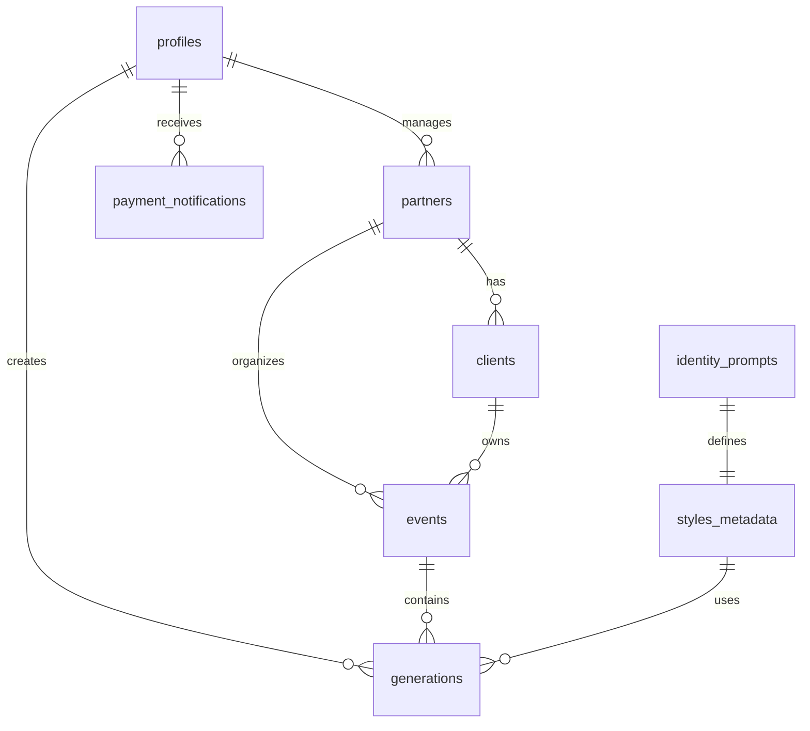

## Schema Overview

Cabina uses PostgreSQL via Supabase with the following core tables:

- **profiles** - User accounts and credits
- **partners** - White-label resellers (B2B)
- **clients** - Partner's customers
- **events** - Photo booth events
- **generations** - AI-generated photos
- **api_key_pool** - Load-balanced AI API keys
- **payment_notifications** - Mercado Pago webhooks
- **styles_metadata** - Available photo styles
- **identity_prompts** - AI prompts for styles

## Core Tables

### profiles

User accounts for the B2C app and authenticated users.

```sql
CREATE TABLE profiles (
  id UUID PRIMARY KEY REFERENCES auth.users(id) ON DELETE CASCADE,
  email TEXT,
  full_name TEXT,
  credits INTEGER DEFAULT 0,
  total_generations INTEGER DEFAULT 0,
  is_master BOOLEAN DEFAULT FALSE,
  role TEXT DEFAULT 'user',
  referral_code TEXT UNIQUE,
  referred_by UUID REFERENCES profiles(id),
  created_at TIMESTAMPTZ DEFAULT NOW(),
  updated_at TIMESTAMPTZ DEFAULT NOW()
);
```

<ParamField path="id" type="uuid" required>
  Primary key, references `auth.users(id)`
</ParamField>

<ParamField path="email" type="text">
  User's email address
</ParamField>

<ParamField path="credits" type="integer" default="0">
  Available credits for B2C users (Modelo A)
</ParamField>

<ParamField path="total_generations" type="integer" default="0">
  Total number of photos generated by this user
</ParamField>

<ParamField path="is_master" type="boolean" default="false">
  Admin flag (Leo = true)
</ParamField>

<ParamField path="role" type="text" default="'user'">
  User role: `'user'`, `'partner'`, `'client'`, or `'master'`
</ParamField>

<ParamField path="referral_code" type="text">
  Unique referral code for this user
</ParamField>

<ParamField path="referred_by" type="uuid">
  References the user who referred this account
</ParamField>

### partners

White-label resellers who create events for their clients.

```sql
CREATE TABLE partners (
  id UUID PRIMARY KEY DEFAULT gen_random_uuid(),
  name TEXT NOT NULL,
  business_name TEXT,
  contact_name TEXT,
  contact_email TEXT,
  user_id UUID REFERENCES profiles(id),
  credits_total INTEGER DEFAULT 0,
  credits_used INTEGER DEFAULT 0,
  is_active BOOLEAN DEFAULT TRUE,
  config JSONB DEFAULT '{}'::jsonb,
  created_at TIMESTAMPTZ DEFAULT NOW(),
  updated_at TIMESTAMPTZ DEFAULT NOW()
);
```

<ParamField path="id" type="uuid" required>
  Primary key
</ParamField>

<ParamField path="name" type="text" required>
  Partner display name
</ParamField>

<ParamField path="user_id" type="uuid">
  Links partner to a login account in `profiles`
</ParamField>

<ParamField path="credits_total" type="integer" default="0">
  Total credits purchased from Master
</ParamField>

<ParamField path="credits_used" type="integer" default="0">
  Credits consumed across all partner events
</ParamField>

<ParamField path="config" type="jsonb">
  White-label configuration:
  ```json
  {
    "primary_color": "#FF6B35",
    "logo_url": "https://...",
    "radius": "0.5rem",
    "style_presets": ["pb_a", "suit_a"]
  }
  ```
</ParamField>

### clients

Partner's end customers who manage specific events.

```sql
CREATE TABLE clients (
  id UUID PRIMARY KEY DEFAULT gen_random_uuid(),
  partner_id UUID NOT NULL REFERENCES partners(id) ON DELETE CASCADE,
  name TEXT NOT NULL,
  email TEXT,
  contact_person TEXT,
  phone TEXT,
  credits_total INTEGER DEFAULT 0,
  credits_used INTEGER DEFAULT 0,
  contracted_styles TEXT[] DEFAULT '{}',
  config JSONB DEFAULT '{}'::jsonb,
  created_at TIMESTAMPTZ DEFAULT NOW()
);
```

<ParamField path="partner_id" type="uuid" required>
  Foreign key to `partners(id)`
</ParamField>

<ParamField path="contracted_styles" type="text[]">
  Array of style IDs this client can use
</ParamField>

### events

Photo booth events with allocated credits and configuration.

```sql
CREATE TABLE events (
  id UUID PRIMARY KEY DEFAULT gen_random_uuid(),
  partner_id UUID REFERENCES partners(id) ON DELETE SET NULL,
  client_id UUID REFERENCES clients(id) ON DELETE SET NULL,
  event_name TEXT NOT NULL,
  event_slug TEXT UNIQUE NOT NULL,
  client_name TEXT,
  client_email TEXT,
  client_access_pin TEXT,
  credits_allocated INTEGER DEFAULT 0,
  credits_used INTEGER DEFAULT 0,
  selected_styles TEXT[] DEFAULT '{}',
  config JSONB DEFAULT '{}'::jsonb,
  start_date TIMESTAMPTZ,
  end_date TIMESTAMPTZ,
  is_active BOOLEAN DEFAULT TRUE,
  created_at TIMESTAMPTZ DEFAULT NOW(),
  updated_at TIMESTAMPTZ DEFAULT NOW()
);
```

<ParamField path="event_slug" type="text" required>
  Unique URL slug for the event (e.g., `quince-sofia-2024`)
  
  Used in URLs: `/?event=quince-sofia-2024`
</ParamField>

<ParamField path="credits_allocated" type="integer" default="0">
  Total credits assigned to this event
</ParamField>

<ParamField path="credits_used" type="integer" default="0">
  Credits consumed by guest generations
  
  **Updated atomically** via `increment_event_credit` RPC
</ParamField>

<ParamField path="selected_styles" type="text[]">
  Array of style IDs enabled for this event
  
  Example: `['pb_a', 'suit_b', 'jhonw_c']`
</ParamField>

<ParamField path="config" type="jsonb">
  Event branding and settings:
  ```json
  {
    "logo_url": "https://...",
    "primary_color": "#FF6B35",
    "welcome_text": "Bienvenidos a la fiesta!"
  }
  ```
</ParamField>

<ParamField path="client_access_pin" type="text">
  Simple PIN for client dashboard access
</ParamField>

### generations

AI-generated photos from both B2C users and event guests.

```sql
CREATE TABLE generations (
  id UUID PRIMARY KEY DEFAULT gen_random_uuid(),
  user_id UUID REFERENCES profiles(id) ON DELETE SET NULL,
  event_id UUID REFERENCES events(id) ON DELETE SET NULL,
  model_id TEXT,
  style_id TEXT,
  image_url TEXT NOT NULL,
  aspect_ratio TEXT DEFAULT '9:16',
  created_at TIMESTAMPTZ DEFAULT NOW()
);
```

<ParamField path="user_id" type="uuid" nullable>
  User who generated this (B2C model)
  
  **Nullable** - event guests don't have accounts
</ParamField>

<ParamField path="event_id" type="uuid" nullable>
  Event this generation belongs to (B2B model)
  
  **Nullable** - B2C generations have no event
</ParamField>

<ParamField path="model_id" type="text">
  AI model/style identifier (e.g., `pb_a`, `suit_b`)
</ParamField>

<ParamField path="image_url" type="text" required>
  URL to the generated image in Supabase Storage or external CDN
</ParamField>

<Note>
**Credit Model Logic:**
- If `user_id` is set: deduct from `profiles.credits`
- If `event_id` is set: deduct from `events.credits_allocated` (atomic RPC)
</Note>

### api_key_pool

Load balancer for AI API keys (Kie.ai).

```sql
CREATE TABLE api_key_pool (
  id UUID PRIMARY KEY DEFAULT gen_random_uuid(),
  api_key TEXT NOT NULL UNIQUE,
  account_name TEXT,
  is_active BOOLEAN DEFAULT TRUE,
  last_used_at TIMESTAMPTZ DEFAULT NOW(),
  usage_count INTEGER DEFAULT 0,
  created_at TIMESTAMPTZ DEFAULT NOW()
);
```

<ParamField path="api_key" type="text" required>
  Kie.ai API key
</ParamField>

<ParamField path="is_active" type="boolean" default="true">
  Whether this key should be used in rotation
</ParamField>

<ParamField path="last_used_at" type="timestamptz">
  Timestamp of last usage (for least-recently-used selection)
</ParamField>

<ParamField path="usage_count" type="integer" default="0">
  Total number of times this key has been used
</ParamField>

<Note>
The `cabina-vision` edge function selects the least recently used active key for each generation request.
</Note>

### payment_notifications

Webhook events from Mercado Pago.

```sql
CREATE TABLE payment_notifications (
  id UUID PRIMARY KEY DEFAULT gen_random_uuid(),
  mercadopago_id TEXT UNIQUE NOT NULL,
  user_id UUID REFERENCES profiles(id),
  status TEXT,
  credits_added INTEGER,
  amount NUMERIC,
  data JSONB,
  created_at TIMESTAMPTZ DEFAULT NOW()
);
```

<ParamField path="mercadopago_id" type="text" required>
  Unique payment ID from Mercado Pago
</ParamField>

<ParamField path="user_id" type="uuid">
  User who made the purchase
</ParamField>

<ParamField path="credits_added" type="integer">
  Number of credits granted for this payment
</ParamField>

<ParamField path="data" type="jsonb">
  Full webhook payload from Mercado Pago
</ParamField>

### styles_metadata

Available photo styles and their metadata.

```sql
CREATE TABLE styles_metadata (
  id TEXT PRIMARY KEY,
  label TEXT,
  category TEXT,
  subcategory TEXT,
  image_url TEXT,
  tags TEXT[] DEFAULT '{}',
  is_premium BOOLEAN DEFAULT FALSE,
  usage_count INTEGER DEFAULT 0,
  created_at TIMESTAMPTZ DEFAULT NOW(),
  updated_at TIMESTAMPTZ DEFAULT NOW()
);
```

<ParamField path="id" type="text" required>
  Style identifier (e.g., `pb_a`, `suit_b`)
</ParamField>

<ParamField path="subcategory" type="text">
  Style pack name (e.g., "Peaky Blinders", "La Ley de los Audaces")
</ParamField>

<ParamField path="tags" type="text[]">
  Searchable tags: `['gangster', 'vintage', 'cap', 'whiskey']`
</ParamField>

<ParamField path="is_premium" type="boolean" default="false">
  Whether this style requires premium access
</ParamField>

### identity_prompts

AI prompts for each style.

```sql
CREATE TABLE identity_prompts (
  id TEXT PRIMARY KEY,
  master_prompt TEXT,
  created_at TIMESTAMPTZ DEFAULT NOW()
);
```

<ParamField path="id" type="text" required>
  Matches `styles_metadata.id`
</ParamField>

<ParamField path="master_prompt" type="text">
  Full AI prompt for image generation
  
  Example:
  ```
  "Professional portrait in the style of Peaky Blinders, 
  1920s Birmingham, wearing flat cap, vintage suit, 
  cinematic lighting, moody atmosphere"
  ```
</ParamField>

## Database Functions

### increment_event_credit

Atomically increments event credit usage.

```sql
CREATE OR REPLACE FUNCTION increment_event_credit(p_event_id UUID)
RETURNS BOOLEAN AS $$
DECLARE
  v_allocated INTEGER;
  v_used INTEGER;
BEGIN
  SELECT credits_allocated, credits_used
  INTO v_allocated, v_used
  FROM events
  WHERE id = p_event_id
  FOR UPDATE;

  IF v_used >= v_allocated THEN
    RETURN FALSE; -- No credits remaining
  END IF;

  UPDATE events
  SET credits_used = credits_used + 1
  WHERE id = p_event_id;

  RETURN TRUE;
END;
$$ LANGUAGE plpgsql;
```

**Usage in Edge Function:**

```typescript
const { data: creditOk, error } = await supabase.rpc(
  'increment_event_credit',
  { p_event_id: event_id }
);

if (!creditOk) {
  throw new Error('Event credits exhausted');
}
```

## Indexes

Key indexes for performance:

```sql
-- Generations lookup by user
CREATE INDEX idx_generations_user_id ON generations(user_id);

-- Generations lookup by event
CREATE INDEX idx_generations_event_id ON generations(event_id);

-- Event lookup by slug (for QR codes)
CREATE INDEX idx_events_slug ON events(event_slug);

-- Partner's events
CREATE INDEX idx_events_partner_id ON events(partner_id);

-- Client's events
CREATE INDEX idx_events_client_id ON events(client_id);

-- API key pool selection
CREATE INDEX idx_api_key_pool_active_lru 
  ON api_key_pool(is_active, last_used_at);
```

## Relationships



## Storage Buckets

### user_photos

- **Purpose:** Temporary storage for uploaded user photos
- **Public:** No
- **RLS:** Users can only access their own uploads

### generations

- **Purpose:** Final AI-generated images
- **Public:** Yes
- **Path:** `results/{user_id}_{timestamp}.png`

### event_assets

- **Purpose:** Event logos and branding
- **Public:** Yes
- **Path:** `events/{event_id}/logo.png`

## Next Steps

<CardGroup cols={2}>
  <Card title="Migrations" icon="database" href="/technical/migrations">
    Learn how to manage database migrations
  </Card>
  <Card title="RLS Policies" icon="shield" href="/technical/rls-policies">
    Understand Row Level Security
  </Card>
</CardGroup>