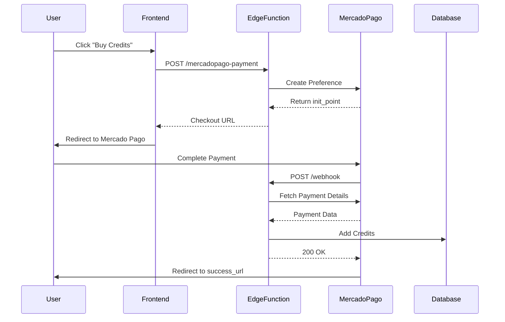

## Overview

Cabina integrates Mercado Pago for credit purchases in the B2C model. The integration uses:

- **Checkout Preferences** - Hosted checkout page
- **Webhooks** - Automatic credit fulfillment
- **Edge Function** - Server-side payment processing

<Note>
This integration is used exclusively for the B2C (public app) model. B2B partner purchases are handled separately.
</Note>

## Architecture



## Setup

### 1. Create Mercado Pago Account

<Steps>
  <Step title="Sign up">
    Go to [Mercado Pago Developers](https://www.mercadopago.com.ar/developers) and create an account
  </Step>
  
  <Step title="Create application">
    - Navigate to **Your integrations**
    - Click **Create application**
    - Fill in app details
    - Save application
  </Step>
  
  <Step title="Get credentials">
    Go to **Credentials** and copy:
    - **Test Access Token** (for development)
    - **Production Access Token** (for production)
    
    Format: `APP_USR-1234567890123456-123456-abcdef...`
  </Step>
</Steps>

### 2. Configure Edge Function Secret

```bash
# Development/Test
supabase secrets set MP_ACCESS_TOKEN=TEST-1234567890-123456-abcdef

# Production
supabase secrets set MP_ACCESS_TOKEN=APP_USR-1234567890-123456-abcdef
```

### 3. Set Up Webhook

<Steps>
  <Step title="Get webhook URL">
    Your webhook URL:
    ```
    https://<project-ref>.supabase.co/functions/v1/mercadopago-payment?webhook=true
    ```
    
    Example:
    ```
    https://elesttjfwfhvzdvldytn.supabase.co/functions/v1/mercadopago-payment?webhook=true
    ```
  </Step>
  
  <Step title="Configure in Mercado Pago">
    1. Go to **Your integrations** → **Webhooks**
    2. Click **Configure webhooks**
    3. Enter your webhook URL
    4. Select events:
       - `payment.created`
       - `payment.updated`
    5. Save
  </Step>
  
  <Step title="Test webhook">
    Mercado Pago will send a test notification. Check Edge Function logs:
    ```bash
    supabase functions logs mercadopago-payment --tail
    ```
  </Step>
</Steps>

## Implementation

### Frontend: Create Payment

```typescript components/PacksView.tsx
import { supabase } from '../lib/supabaseClient';

const handlePurchase = async (
  userId: string,
  packName: string,
  credits: number,
  price: number
) => {
  try {
    // Create payment preference
    const { data, error } = await supabase.functions.invoke(
      'mercadopago-payment',
      {
        body: {
          user_id: userId,
          credits: credits,
          price: price,
          pack_name: packName,
          redirect_url: window.location.origin + '/success'
        }
      }
    );

    if (error || data.error) {
      throw new Error(data?.message || 'Error creating payment');
    }

    // Redirect to Mercado Pago checkout
    window.location.href = data.init_point;
  } catch (error) {
    console.error('Payment error:', error);
    alert('Error al procesar el pago');
  }
};

// Usage in component
<button onClick={() => handlePurchase(
  user.id,
  'Pack Premium',
  500,
  2500.00
)}>
  Comprar 500 Créditos - $2,500
</button>
```

### Backend: Edge Function

See full implementation in [mercadopago-payment API reference](/api/payment-webhook).

**Key parts:**

```typescript supabase/functions/mercadopago-payment/index.ts
// Create preference
const preference = {
  items: [{
    title: `Pack ${pack_name} - ${credits} Créditos`,
    unit_price: Number(price),
    quantity: 1,
    currency_id: "ARS"
  }],
  external_reference: `${user_id}:${credits}`,
  notification_url: webhookUrl
};

const response = await fetch(
  'https://api.mercadopago.com/checkout/preferences',
  {
    method: 'POST',
    headers: {
      'Authorization': `Bearer ${MP_ACCESS_TOKEN}`,
      'Content-Type': 'application/json'
    },
    body: JSON.stringify(preference)
  }
);
```

**From source:** `supabase/functions/mercadopago-payment/index.ts:35-59`

### Webhook Handler

```typescript supabase/functions/mercadopago-payment/index.ts
// Fetch payment details
const mpRes = await fetch(
  `https://api.mercadopago.com/v1/payments/${paymentId}`,
  {
    headers: { 'Authorization': `Bearer ${MP_ACCESS_TOKEN}` }
  }
);

const paymentData = await mpRes.json();

if (paymentData.status === 'approved') {
  // Parse external_reference
  const [userId, creditsToAdd] = paymentData.external_reference.split(':');
  
  // Check idempotency
  const existing = await checkIfProcessed(paymentId);
  
  if (!existing) {
    // Record payment
    await recordPayment(paymentId, paymentData);
    
    // Add credits to user
    await addCreditsToUser(userId, parseInt(creditsToAdd));
  }
}
```

**From source:** `supabase/functions/mercadopago-payment/index.ts:87-128`

## Credit Packs Configuration

Define your credit packs in the frontend:

```typescript constants/packs.ts
export const CREDIT_PACKS = [
  {
    name: 'Starter',
    credits: 100,
    price: 500,
    currency: 'ARS',
    popular: false
  },
  {
    name: 'Premium',
    credits: 500,
    price: 2000,
    currency: 'ARS',
    popular: true,
    discount: 20 // 20% off
  },
  {
    name: 'Pro',
    credits: 1000,
    price: 3500,
    currency: 'ARS',
    popular: false,
    discount: 30
  }
];
```

## Testing

### Test Cards

Mercado Pago provides test cards for different scenarios:

**Approved payment:**
```
Card Number: 5031 7557 3453 0604
Expiry: 11/25
CVV: 123
Name: APRO
```

**Rejected payment:**
```
Card Number: 5031 7557 3453 0604
Expiry: 11/25
CVV: 123
Name: OTROC
```

**Pending payment:**
```
Card Number: 5031 7557 3453 0604
Expiry: 11/25
CVV: 123
Name: CONT
```

[Complete test card list](https://www.mercadopago.com.ar/developers/es/guides/online-payments/checkout-api/testing)

### Test Workflow

<Steps>
  <Step title="Use test credentials">
    Set `MP_ACCESS_TOKEN` to your **Test** access token
  </Step>
  
  <Step title="Create test payment">
    ```typescript
    await handlePurchase(testUserId, 'Test Pack', 100, 1);
    ```
  </Step>
  
  <Step title="Complete checkout">
    - Use test card from above
    - Fill in any name and email
    - Complete payment
  </Step>
  
  <Step title="Verify webhook">
    Check function logs:
    ```bash
    supabase functions logs mercadopago-payment
    ```
    
    Should see:
    ```
    Webhook received body: {"type":"payment","data":{"id":"123"}}
    Processing payment with ID: 123
    Payment Data from MP: {"status":"approved",...}
    ```
  </Step>
  
  <Step title="Verify credits added">
    ```sql
    SELECT credits FROM profiles WHERE id = '<test-user-id>';
    ```
  </Step>
</Steps>

### Local Testing with ngrok

To test webhooks locally:

```bash
# Terminal 1: Start Supabase functions
supabase functions serve

# Terminal 2: Expose with ngrok
ngrok http 54321

# Use ngrok URL in Mercado Pago webhook config
https://abc123.ngrok.io/functions/v1/mercadopago-payment?webhook=true
```

## Error Handling

### Common Errors

<AccordionGroup>
  <Accordion title="Invalid client_id or client_secret">
    **Cause:** MP_ACCESS_TOKEN is incorrect or expired
    
    **Solution:**
    - Regenerate token in Mercado Pago dashboard
    - Update edge function secret
    - Ensure you're using Access Token, not Client ID
  </Accordion>

  <Accordion title="Webhook not received">
    **Possible causes:**
    - Wrong webhook URL configured
    - Edge function not deployed
    - Firewall blocking Mercado Pago
    
    **Debug:**
    ```bash
    # Check function is accessible
    curl https://your-project.supabase.co/functions/v1/mercadopago-payment?webhook=true
    
    # Should return 404 (not 403)
    ```
  </Accordion>

  <Accordion title="Credits not added after payment">
    **Check:**
    1. Webhook received? (check logs)
    2. Payment approved? (check Mercado Pago dashboard)
    3. Already processed? (check `payment_notifications` table)
    
    **Manual fix:**
    ```sql
    UPDATE profiles 
    SET credits = credits + 500 
    WHERE id = '<user-id>';
    ```
  </Accordion>

  <Accordion title="Duplicate credits added">
    **Cause:** Webhook sent multiple times, idempotency check failed
    
    **Prevention:**
    The function checks `payment_notifications.mercadopago_id` before processing
    
    **Fix:**
    ```sql
    -- Check duplicates
    SELECT mercadopago_id, COUNT(*) 
    FROM payment_notifications 
    GROUP BY mercadopago_id 
    HAVING COUNT(*) > 1;
    
    -- Remove excess credits manually
    ```
  </Accordion>
</AccordionGroup>

## Production Checklist

<Steps>
  <Step title="Use production credentials">
    - [ ] `MP_ACCESS_TOKEN` set to production token
    - [ ] Test with real card (small amount)
  </Step>
  
  <Step title="Configure production webhook">
    - [ ] Webhook URL points to production edge function
    - [ ] Webhook responds with 200 OK
    - [ ] Test notification received
  </Step>
  
  <Step title="Set appropriate prices">
    - [ ] Verify pack prices in ARS
    - [ ] Test purchasing flow
    - [ ] Confirm credits added correctly
  </Step>
  
  <Step title="Enable monitoring">
    - [ ] Set up alerts for failed payments
    - [ ] Monitor webhook logs
    - [ ] Track successful purchases
  </Step>
  
  <Step title="Legal compliance">
    - [ ] Add terms and conditions
    - [ ] Privacy policy for payments
    - [ ] Refund policy clearly stated
  </Step>
</Steps>

## Security Best Practices

<CardGroup cols={2}>
  <Card title="Never expose access token" icon="eye-slash">
    Always use edge functions, never client-side
  </Card>
  
  <Card title="Validate webhook origin" icon="shield-check">
    Optionally verify requests come from Mercado Pago IPs
  </Card>
  
  <Card title="Implement idempotency" icon="check-double">
    Always check payment_notifications before crediting
  </Card>
  
  <Card title="Log all transactions" icon="file-text">
    Store full webhook payload for auditing
  </Card>
</CardGroup>

## Monitoring & Analytics

### Track Purchases

```sql
-- Daily revenue
SELECT 
  DATE(created_at) as date,
  COUNT(*) as purchases,
  SUM(amount) as revenue,
  SUM(credits_added) as credits_sold
FROM payment_notifications
WHERE status = 'approved'
GROUP BY DATE(created_at)
ORDER BY date DESC;

-- Top buyers
SELECT 
  p.email,
  COUNT(*) as purchases,
  SUM(pn.credits_added) as total_credits
FROM payment_notifications pn
JOIN profiles p ON p.id = pn.user_id
WHERE pn.status = 'approved'
GROUP BY p.email
ORDER BY purchases DESC
LIMIT 10;
```

### Mercado Pago Dashboard

Monitor in [Mercado Pago Dashboard](https://www.mercadopago.com.ar):
- Total sales
- Approval rate
- Chargebacks
- Failed payments

## Advanced Features

### Installment Payments

Enable installments in preference:

```typescript
const preference = {
  // ... other fields
  installments: 3, // Max installments
  payment_methods: {
    installments: 3
  }
};
```

### Discounts and Coupons

```typescript
const preference = {
  // ... other fields
  marketplace_fee: 0,
  differential_pricing: {
    id: 123 // Discount ID from MP
  }
};
```

### Split Payments (Marketplace)

For revenue sharing with partners:

```typescript
const preference = {
  // ... other fields
  marketplace_fee: 100, // Your commission in ARS
  marketplace: 'YOUR_MARKETPLACE_ID'
};
```

## Next Steps

<CardGroup cols={2}>
  <Card title="Payment Webhook API" icon="webhook" href="/api/payment-webhook">
    Complete API reference
  </Card>
  <Card title="Edge Functions" icon="function" href="/api/edge-functions">
    Learn about edge functions
  </Card>
</CardGroup>